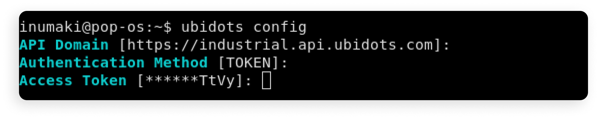
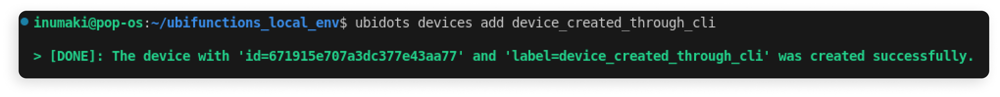
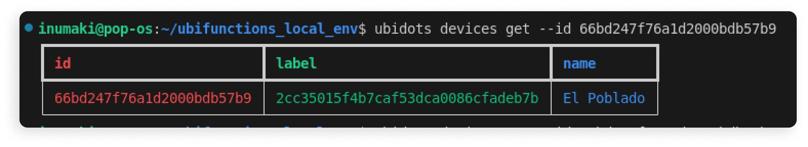
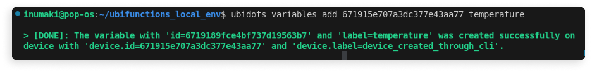
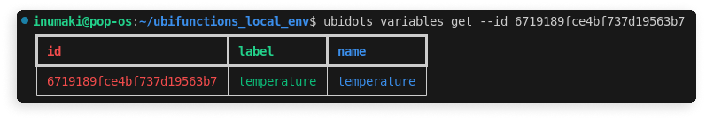
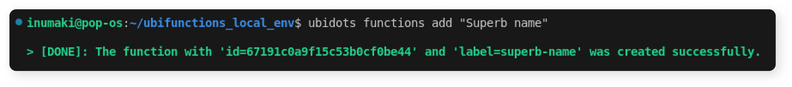
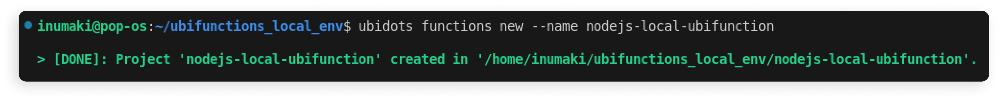
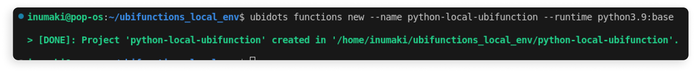

# Ubidots CLI 
1. [Overview](#overview)
2. [Requirements](#requirements)
3. [Installation](#installation)
4. [Getting started](#getting-started)
5. [Available commands](#available-commands)
6. [`ubidots config`](#ubidots-config)

# Overview 

The Ubidots command line interface (CLI) provides:

1. A fully-featured local development environment for UbiFunctions, replicating runtimes and their included libraries, enabling developers to seamlessly write, test, and deploy serverless functions directly from their local machine.
2. CRUD (Create, Read, Update, Delete) operations for the following entities in Ubidots:
   - Devices
   - Variables
   - Functions

# Requirements

- [Python 3.9 or higher](https://www.python.org/)
- [Docker](https://docs.docker.com/engine/install/ubuntu/) (required only for local UbiFunctions development)


# Installation
```bash
$ pip install /path/to/ubidots-cli.whl
```
Once installed, verify the installation by checking the help menu:
```bash
ubidots --help
```

# Getting started

## Configure the CLI cloud settings 
```bash
ubidots config
```


## Devices
### Create a new device
```bash
ubidots devices add device_created_through_cli
```


### Read a device 
```bash
ubidots devices get --id <id> 
```


## Variables
### Create a new variable
```bash
ubidots variables add <device-id> <variable-label>
```


### Read a variable
```bash
ubidots variables get --id <variable-id> 
```


## UbiFunctions

### Create a new `NodeJS` UbiFunction
```bash
ubidots functions add <UbiFunction name>
```


### Create a new `Python` UbiFunction
```bash
ubidots functions add <UbiFunction name>
```



### Create a new local `NodeJS` UbiFunction
```bash
ubidots functions new --name nodejs-local-ubifunction
```


### Create a new local `Python` UbiFunction
```bash
ubidots functions new --name python-local-ubifunction --runtime python3.9:base
```


# Available commands
- `config`: Configures essential CLI settings required for proper operation.
- `devices`: Provides CRUD functionality over Ubidots devices.
- `variables`: Provides CRUD functionality over Ubidots variables.
- `functions`: Provides CRUD functionality over UbiFunctions as well as the capability to set up a local development environment for UbiFunctions.


# `ubidots config`
This command configures the CLI cloud settings required to connect with your Ubidots account. It will prompt you for:

- **API domain**: Leave the default value unless you are on a ubidots private deployment.
- **Authentication method**: The authentication method that you'd like to use.
- **Access token**: A valid [Ubidots token](https://help.ubidots.com/en/articles/590078-find-your-token-from-your-ubidots-account)

```bash
> ubidots config

API Domain [https://industrial.api.ubidots.com]: 
Authentication Method [TOKEN]: 
Access Token [*******************************pPem]: 

> [DONE]: Configuration saved successfully.
```

This configuration will be saved at `$HOME/.ubidots_cli/config.yaml`. You can check it running `cat`:

```bash
> cat $HOME/.ubidots_cli/config.yaml
access_token: <ubidots-token> 
api_domain: https://industrial.api.ubidots.com
auth_method: X-Auth-Token
```

